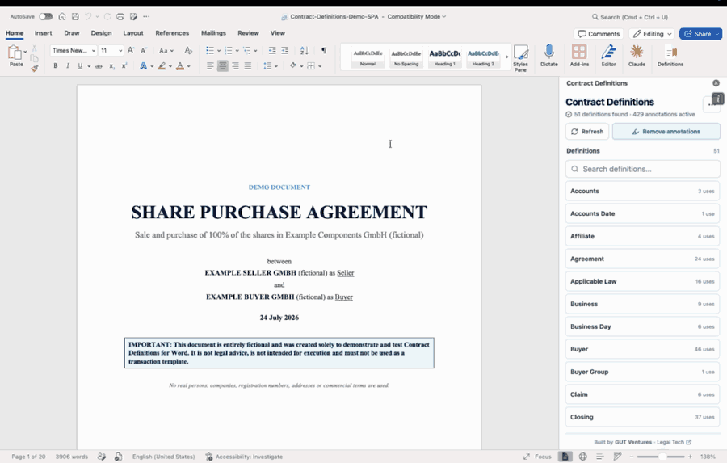
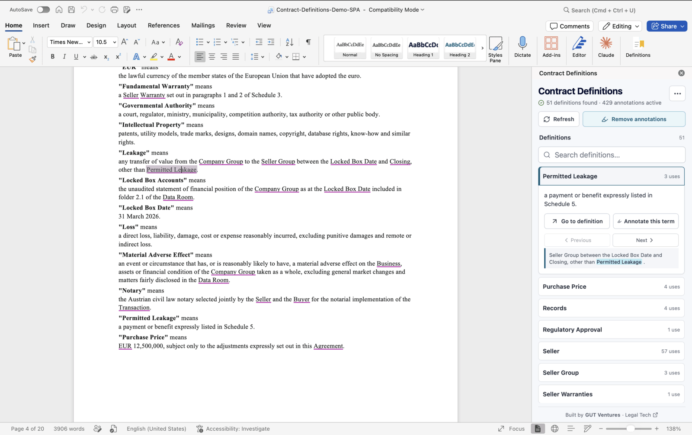

# Contract Definitions

An open-source, local-first Microsoft Word add-in for finding, reviewing, and navigating defined terms in English contracts.

**No document uploads, AI provider, API key, telemetry, analytics, or application backend.** The add-in reads the open document through Office.js and processes it inside the Word task pane.



_Recorded in Microsoft Word using the repository's [entirely fictional demo SPA](demo/Contract-Definitions-Demo-SPA.docx)._

## Why This Exists

Long contracts such as share purchase agreements (SPAs), shareholders' agreements, and financing documents can contain dozens or even hundreds of defined terms. During a review, readers repeatedly have to leave the clause they are working on, search for a term's definition, understand it, and then return to the original provision.

This makes contract review slower and makes it difficult to maintain an overview of which definitions are used throughout the document — and which may not be used at all.

Contract Definitions turns the definitions in the open document into a searchable, navigable index inside Microsoft Word. It helps reviewers:

- read definitions without losing their place in the contract;
- jump directly to a definition and through its detected occurrences;
- identify definitions with no detected use outside their own definition;
- pin important terms while reviewing a document; and
- navigate long, definition-heavy contracts more efficiently.

## Features

- Detects defined terms with deterministic, rule-based parsing.
- Presents definitions in a searchable list inside Microsoft Word.
- Lets you pin important terms while reviewing a contract.
- Jumps from a term to its definition and through its occurrences in the document.
- Responds to selected defined terms by opening the matching definition.
- Optionally adds temporary inline annotations to defined-term occurrences.
- Lets you refresh the results after the document changes without storing earlier scans.



_Review a definition, its usage count, and the current occurrence without leaving the contract clause._

## Privacy by Design

Contract Definitions has no application server. Document text is read through Office.js and processed in the add-in WebView. Contract text and scan results:

- are not uploaded to GUT Ventures or another application backend;
- are not sent to an AI provider;
- are not used for telemetry or analytics;
- remain in task-pane memory only; and
- are not written to browser or WebView storage.

Local storage is used only for non-document preferences, such as the inline-annotation mode. The add-in loads Office.js from Microsoft's official CDN, as required for Office add-ins.
The production Content Security Policy sets `connect-src 'none'`, so the WebView
blocks application network connections such as Fetch, XHR, WebSockets, and beacons.

## Requirements

- Microsoft Word with support for Office task-pane add-ins.
- An English-language contract in an editable Word document.
- Node.js `>=20.19.0` for local development or building a self-hosted version.

Inline annotations require a Microsoft 365 version of Word that supports the Word Annotation APIs. The definition list and navigation remain available when annotations are not supported.

## Run Locally

Install the dependencies, trust a local development certificate, and start the HTTPS development server:

```bash
npm ci
npm run certs
npm run dev
```

The add-in is then available at:

```text
https://localhost:3002/
```

Sideload `manifest.xml` in Microsoft Word while the development server is running. Microsoft provides platform-specific instructions for [sideloading Office add-ins](https://learn.microsoft.com/en-us/office/dev/add-ins/testing/sideload-office-add-ins-for-testing).

For a browser-only preview with a sample contract, run:

```bash
npm run dev:http -- --port 3010
```

The browser preview is intended for UI development. Document reading, navigation, and annotations require Microsoft Word.

## Self-Hosting

The add-in is a static client-side application. It requires no application server, database, account system, or API key and can be hosted on any static HTTPS host, including an internal company server.

Build the production files:

```bash
npm ci
npm run build
```

The complete web application is written to `dist/`. To deploy it for your organization:

1. Serve the contents of `dist/` from the root of an HTTPS origin you control, for example `https://contract-definitions.example.com`.
2. Copy `manifest.xml` to a deployment-specific file such as `manifest.production.xml`.
3. Replace every occurrence of `https://localhost:3002` in that copy with your HTTPS origin.
4. Replace the manifest's `<Id>` value with a new unique GUID so the deployment has its own add-in identity.
5. Sideload the deployment manifest for testing or ask a Microsoft 365 administrator to deploy it through the [Integrated Apps portal](https://learn.microsoft.com/en-us/microsoft-365/admin/manage/manage-deployment-of-add-ins).

The current Vite build uses root-relative asset URLs, so deploy it at the root of the chosen origin rather than below a URL path. In the unmodified build, the host serves only static assets and receives no contract text; document access and processing happen inside Word through Office.js.

## Organization-Wide Deployment

Organizations can distribute Contract Definitions centrally instead of asking every user to sideload it. After hosting the production build over HTTPS and preparing a deployment-specific manifest, a Microsoft 365 administrator can upload the XML manifest through the Microsoft 365 Admin Center and assign the add-in to selected users, groups, or the entire organization.

Microsoft documents this process under [centralized deployment through Integrated Apps](https://learn.microsoft.com/en-us/microsoft-365/admin/manage/manage-deployment-of-add-ins). The exact Microsoft 365 requirements and available administration options depend on the organization's tenant configuration.

## Deployment and Customization Support

Want to introduce the add-in across your legal team, adapt it to firm-specific contract structures, or build another Microsoft Word workflow?

[GUT Ventures](https://gut-ventures.com/?utm_source=github&utm_medium=repository&utm_campaign=contract_definitions) develops custom Legal Tech solutions and can support organizations with deployment planning, self-hosting, Microsoft 365 rollout, security and privacy requirements, and product-specific customization.

[Discuss your use case with GUT Ventures](mailto:lukas@gut-ventures.com?subject=Contract%20Definitions%20deployment%20or%20customization)

## Verification

Run the complete local verification suite before submitting a change:

```bash
npm run typecheck
npm test
npm run build
npm audit
```

## Current Limitations

- The parser is designed for English contracts and common definition-clause structures.
- Deterministic parsing avoids sending text to an AI service, but unusual or ambiguous drafting may not be detected correctly.
- Inline annotations depend on Microsoft 365 support for the relevant Word APIs and are temporary; they are not persisted in the document.
- The project assists with contract navigation and does not provide legal advice.

If you find a definition structure that is not detected correctly, please open an issue with a synthetic or anonymized example. Do not include confidential contract text in public issues.

## Contributing

Issues and pull requests are welcome. Please include tests for parser changes and make sure the verification commands above pass.

## License

Contract Definitions is available under the [MIT License](LICENSE).

Built and maintained by [GUT Ventures](https://gut-ventures.com/?utm_source=github&utm_medium=repository&utm_campaign=contract_definitions).
